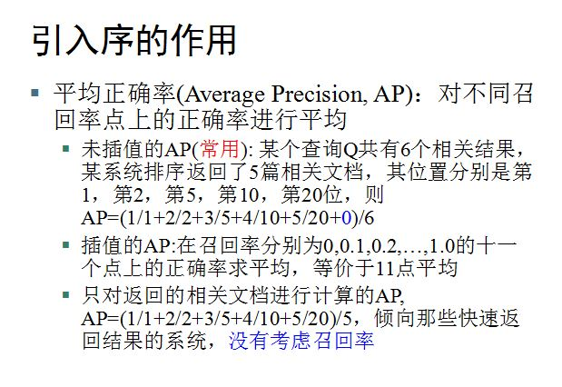

# Lucene

## Analyzer
- [深入浅出Lucene Analyzer](http://grunt1223.iteye.com/blog/969197)
- WhiteSpaceAnalyzer: 只取非空白，以空白为间隔(最快)
- SimpleAnalyzer: 只取字母，以非字母为间隔，并转为小写
- StopAnalyzer: 只取字母，转为小写，并去停用词
- EnglishAnalyzer: 未知

```java
//test Analyzer's code
public class MyAnalyzer extends Analyzer {
 
   private Version matchVersion;
   
   public MyAnalyzer(Version matchVersion) {
     this.matchVersion = matchVersion;
   }
 
   @Override
   protected TokenStreamComponents createComponents(String fieldName) {
     return new TokenStreamComponents(new WhitespaceTokenizer(matchVersion));
   }
   
   public static void main(String[] args) throws IOException {
     // text to tokenize
     final String text = "This is a demo of the TokenStream API";
     
     Version matchVersion = Version.LUCENE_XY; // Substitute desired Lucene version for XY
     MyAnalyzer analyzer = new MyAnalyzer(matchVersion);
     TokenStream stream = analyzer.tokenStream("field", new StringReader(text));
     
     // get the CharTermAttribute from the TokenStream
     CharTermAttribute termAtt = stream.addAttribute(CharTermAttribute.class);
 
     try {
       stream.reset();
     
       // print all tokens until stream is exhausted
       while (stream.incrementToken()) {
         System.out.println(termAtt.toString());
       }
     
       stream.end();
     } finally {
       stream.close();
     }
   }
 }
 ```

## Index
- [csdn: how to accelerate index](http://blog.csdn.net/zengbin164/article/details/5996112)
- important: MergePolicy --> 设置为对数合并索引算法LogDocMergePolicy/LogByteSizeMergePolicy, 因为文件小而多，大致上为2KB * 5000000

```
WhiteSpaceAnalyzer(未完成):
current run time is 5407
total run time is 2444656
fileNum=413	 fileName=E:\DataSet\WT10G\WTX009\B13


Analyzer analyzer = CustomAnalyzer.builder()
	    		   .withTokenizer("WhiteSpace")
	    		   .addTokenFilter("PorterStem")
	    		   .addTokenFilter("stop")
	    		   .build();

current run time is 7043
total run time is 2833166
fileNum=523	 fileName=E:\DataSet\WT10G\WTX011\B23

current run time is 790
total run time is 43253649
fileNum=5157	 fileName=E:\DataSet\WT10G\WTX104\B07
```
## Search
- 输出1000个(或更少)的相关文档，按降序排列好
- 需要解决多义，拼写错误,缩写的问题
- 相关性分三级，但这只与评价有关，与搜索无关

```
correct-word error-word
when whan
tartan tartin
benefits bennefits
composition  compostion
caribbean carribean
rosebowl rose bowl 

import org.gauner.jSpellCorrect.ToySpellingCorrector;
ToySpellingCorrector sc = new ToySpellingCorrector();
// train some data from a text file
sc.trainFile("/tmp/big.txt");
// train a single word
sc.trainSingle("some word");
// get the best suggestion
System.out.println(sc.correct("Cads"));
System.out.println(sc.correct("Dok"));
System.out.println(sc.correct("Speling"));
```

## output

```
TREC返回结果格式为：

<查询ID> Q0 <文档ID> <文档排序> <文档评分> <系统ID>

例如：

501 Q0 WTX046-B13-199 1 16.827150770678543 InL2c7.0

其中Q0没有具体意义，仅起到分隔作用，方便结果文件的脚本处理。

```

## Evoluation
- 计算MAP




##　改进
```
overview: file:///D:/yzbx_allthing/lucene-5.4.0/docs/core/org/apache/lucene/search/package-summary.html#package_description
org.apache.lucene.queries.mlt.MoreLikeThisQuery
org.apache.lucene.search.FuzzyQuery
file:///D:/yzbx_allthing/lucene-5.4.0/docs/core/org/apache/lucene/search/similarities/package-summary.html
file:///D:/yzbx_allthing/lucene-5.4.0/docs/core/org/apache/lucene/index/NumericDocValues.html
```

## 结果
```
rawMAP=7.304471564303862 feedbackMAP=6.189165466981146
```